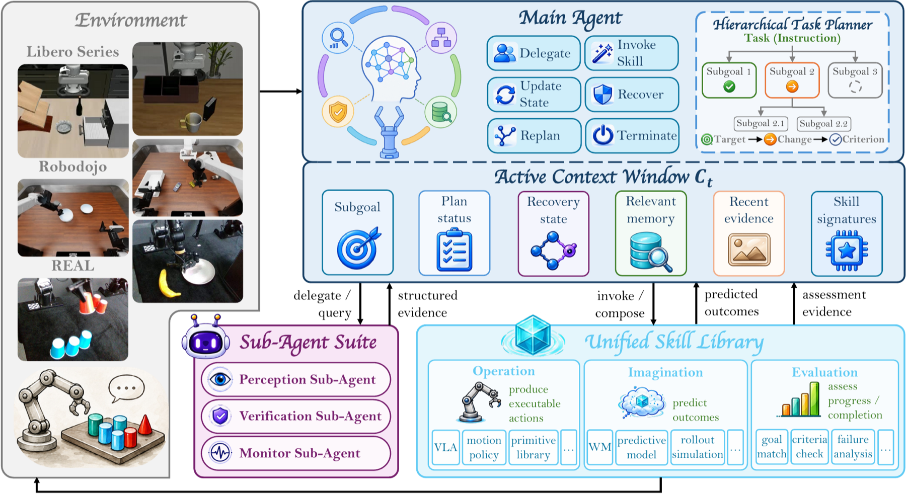
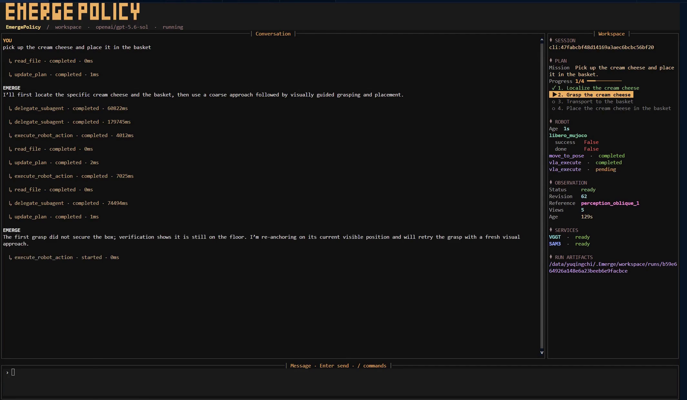

<div align="center">

# EMERGE-Policy

### A Robot Mind Emerges Beyond a Single Policy

Zhirui Fang<sup>&#42;</sup>, Qingchi Yu<sup>&#42;†</sup>, Ziyang Chen<sup>&#42;</sup>, Longfei Li<sup>&#42;†</sup><br>
Haoran Ma<sup>†</sup>, Keru Zhou, Xinrun Xu, Samith Va, Yuxuan Hu<sup>†</sup>, Peixuan Song, Qiang Du<br>
Bin Qian, Yongkang Deng<sup>†</sup>, Xin Li<sup>†</sup>, Yezhen Wang, Zhe Li, Hao Luo<br>
Shuyan Li, Ziwei Wang, Weijian Deng, Xiu Li<sup>✉</sup>

Tsinghua University · Nanjing University of Science and Technology · Xi'an Jiaotong University · Xidian University · Harbin Institute of Technology · Peking University · Nanyang Technological University

<sup>&#42;</sup> Equal contribution &nbsp;&nbsp; <sup>†</sup> Work done during internship at Tsinghua University &nbsp;&nbsp; <sup>✉</sup> Corresponding author

[](https://emerge-policy.github.io/EMERGE-Policy/)
[](https://arxiv.org/pdf/2608.29896)
[](https://arxiv.org/abs/2608.29896)
[](https://github.com/EMERGE-Policy/EMERGE-Policy)

</div>

<p align="center">
  
</p>

<table align="center" width="100%">
  <tr>
    <td align="center">
      <br>
      <h3> &nbsp; ❝ Thinking outside the brain means skillfully engaging entities external to our heads. ❞ &nbsp; </h3>
      <p><strong>— Annie Murphy Paul, <em>The Extended Mind</em></strong></p>
      <br>
    </td>
  </tr>
</table>

##  What's New

-  **[September 16, 2026]** We release the WAM version of EMERGE-Policy! This new
  version integrates Cosmos Policy WAM alongside the original OpenPI VLA version,
  with isolated model servers, multi-worker batched inference, and evaluation on
  standard LIBERO and LIBERO-Plus. LIBERO-Pro evaluation currently remains on the
  VLA version.

-  **[September 7, 2026]** We release the new EMERGE-Policy CLI! The new `emerge`
  command provides a simpler, unified entrypoint for launching and interacting
  with the embodied agent.

-  **[August 30, 2026]** The first version of EMERGE-Policy is now available! This
  initial release introduces an embodied control framework in which a primary agent
  coordinates planning while multiple sub-agents collaborate on perception and
  verification. It also establishes the first end-to-end closed-loop execution
  pipeline, marking the project's first step from a single policy toward
  multi-policy collaboration and continual evolution.

##  Beautiful CLI

EMERGE-Policy includes a polished interactive CLI that brings conversations,
live plan progress, robot state, observations, service readiness, and run
artifacts into one terminal workspace. Launch it with the `emerge` command.

<p align="center">
  <a href="docs/videos/TUI/tui_demo.mp4">
    
  </a>
</p>

<p align="center"><em>Click the screenshot to watch the CLI demo.</em></p>

## Overview

Embodied-intelligence research has traditionally pursued a single end-to-end
model. Long-horizon tasks, however, require frequent low-level perception,
context-intensive high-level planning, and fine-grained action generation. These
competing workloads are difficult to reconcile within one model and can lead to
confused reasoning, accumulated errors, and eventual task failure.

**EMERGE-Policy introduces a new embodied-intelligence system paradigm.**
Intelligence is not confined to any individual model. Instead, a graph-structured
agent orchestrates tasks asynchronously and concurrently, invoking specialized
models as tools for perception, planning, action, and verification. System-level
intelligence thereby **emerges** through the coordinated interaction of multiple
components.

This architecture mirrors how humans exercise intelligence while interacting
with the world: our eyes perceive the environment, our hands perform physical
skills, and our brains plan and imagine. Different heterogeneous organs contribute
different capabilities, while coherent intelligence arises from their
collaboration.

## Installation

### 1. Clone the Repository

```bash
git clone --recurse-submodules \
  https://github.com/EMERGE-Policy/EMERGE-Policy.git
cd Emerge-Policy

git submodule sync --recursive
git submodule update --init --recursive
```

### 2. Install the Main `EmergePolicy` Environment

```bash
conda create -n EmergePolicy python=3.12 -y
conda activate EmergePolicy
python -m pip install --upgrade pip wheel "setuptools<82"

python -m pip install \
  -e ".[libero]" \
  -e third_party/vggt \
  -e third_party/sam3 \
  -e third_party/openpi/packages/openpi-client

bash third_party/imagemagick_env/install.sh
```

### 3. Install the Standalone OpenPI Environment `pi05_server`

pi05 Policy runs in its own Conda environment; do not install its server
dependencies into `EmergePolicy`.

```bash
conda create -n pi05_server python=3.12 -y
conda activate pi05_server
python -m pip install --upgrade pip uv

cd third_party/openpi
GIT_LFS_SKIP_SMUDGE=1 uv pip install \
  --python "$CONDA_PREFIX/bin/python" \
  -e .
cd ../..
```

### 4. Install the Standalone Cosmos Policy Environment `cosmos-policy`

Cosmos Policy runs in its own Conda environment; do not install its server
dependencies into `EmergePolicy`.

```bash
conda create -n cosmos-policy python=3.10 -y
conda activate cosmos-policy
python -m pip install --upgrade pip uv

cd third_party/cosmos-policy
uv pip install \
  --python "$CONDA_PREFIX/bin/python" \
  -e ".[cu128]" \
  --group libero \
  "websockets>=16,<17" \
  "msgpack>=1.1,<2"
cd ../..
```

## Quick Start

The Python package is named `Emerge`, and the installed command-line entry point
is `emerge`. The default configuration file is `~/.Emerge/config.json`, and the
default workspace is `~/.Emerge/workspace`.

Initialize the configuration and workspace before the first run:

```bash
emerge workspace init
```

This creates `~/.Emerge/config.json`, initializes `~/.Emerge/workspace`, and
installs the bundled workspace templates. Add the required provider credentials
to the generated configuration before launching the agent.

Start the Controller in one terminal:

```bash
python -m robot.controller \
  --driver libero_mujoco \
  --driver-config dev/libero_mujoco_driver_sample.json
```

Run the agent CLI in another terminal:

```bash
emerge
```

Choose one policy backend and start it together with the shared VGGT and SAM3
perception services. The launcher, standard LIBERO evaluation, and LIBERO-Plus
evaluation default to WAM. LIBERO-Pro supports VLA only.
For the OpenPI VLA backend (use `--policy-backend vla` for evaluation):

```bash
OPENPI_GPU=0 \
VGGT_GPU=1 \
SAM3_GPU=2 \
bash scripts/model_server/start_external_model_servers.sh --services openpi,vggt,sam3
```

For the Cosmos Policy WAM backend:

```bash
WAM_GPU=0 \
VGGT_GPU=1 \
SAM3_GPU=2 \
bash scripts/model_server/start_external_model_servers.sh --services cosmos,vggt,sam3
```

The launcher uses the `cosmos-policy` environment and the default paths under
`checkpoints/cosmos-policy/`; VGGT and SAM3 continue to use `EmergePolicy`.
Check readiness from another terminal:

```bash
curl http://127.0.0.1:8003/healthz
curl http://127.0.0.1:8001/healthz
curl http://127.0.0.1:8002/healthz
```

## Model Checkpoints

Download the external model checkpoints to `checkpoints/` in the repository root:

| Model | Source and Contents | Destination |
|---|---|---|
| OpenPI π0.5-LIBERO | Fetch `gs://openpi-assets/checkpoints/pi05_libero` from the [official OpenPI checkpoint repository](https://github.com/Physical-Intelligence/openpi#model-checkpoints) | `checkpoints/pi05_libero/` |
| VGGT-1B | Download `model.pt` from [`facebook/VGGT-1B`](https://huggingface.co/facebook/VGGT-1B) | `checkpoints/vggt/model.pt` |
| SAM3 | Download `sam3.pt` from [`facebook/sam3`](https://www.modelscope.cn/models/facebook/sam3/files) on ModelScope | Rename it to `checkpoints/sam3/model.pt` |
| Cosmos Policy (optional) | Download the policy weights, statistics, and T5 cache from [`nvidia/Cosmos-Policy-LIBERO-Predict2-2B`](https://huggingface.co/nvidia/Cosmos-Policy-LIBERO-Predict2-2B) | `checkpoints/cosmos-policy/` |
| Cosmos Predict2 (optional) | Download the base model from [`nvidia/Cosmos-Predict2-2B-Video2World`](https://huggingface.co/nvidia/Cosmos-Predict2-2B-Video2World) | `checkpoints/cosmos-policy/Cosmos-Predict2-2B-Video2World/` |

## External Model Service Ports

The startup script launches the selected persistent services, keeping model
loading independent from individual agent episodes.

| Service | Port | Environment | Purpose |
|---|---:|---|---|
| OpenPI | 8000 | `pi05_server` | VLA action inference |
| VGGT | 8001 | `EmergePolicy` | Multi-view geometry estimation |
| SAM3 | 8002 | `EmergePolicy` | Prompt-guided image segmentation |
| Cosmos Policy | 8003 | `cosmos-policy` | WAM candidate action generation and scoring |

For additional startup options and health-check endpoints, see
[`scripts/model_server/README.md`](scripts/model_server/README.md).

## Evaluation

- [Standard LIBERO Evaluation](scripts/Libero_eval/README.md)
- [LIBERO-Plus Robustness Evaluation](scripts/LiberoPlus_eval/README.md)
- [LIBERO-Pro Evaluation](scripts/LiberoPro_eval/README.md)
